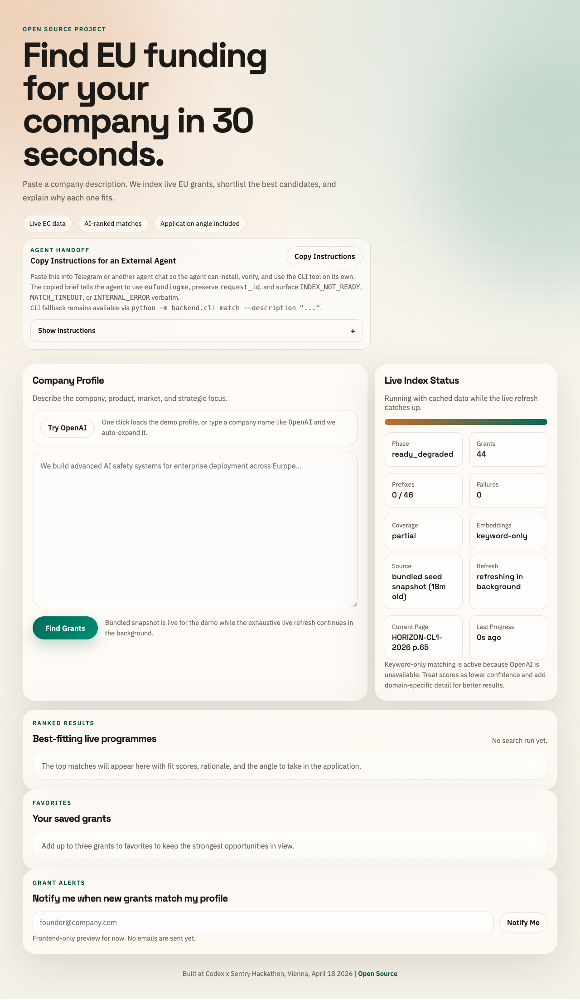
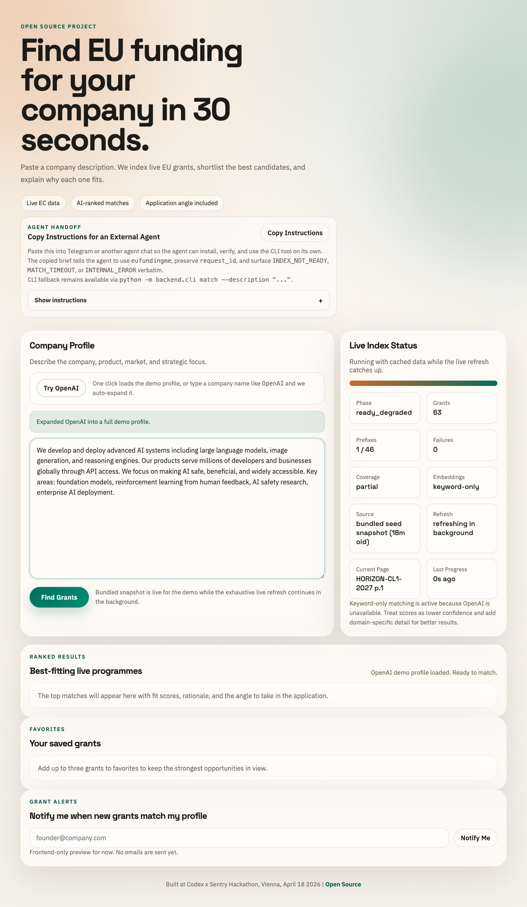

# EU Grant Matcher

Find EU funding for your company in 30 seconds.

**🚀 Try it now at [fundingme.eu](https://fundingme.eu)** or run it locally.

[](https://github.com/bumpkingsol/eufundingme/releases/download/media-v1/promo.mp4)

_Click the preview above for the full 1920×1080 MP4 with sound._

This open-source app works in three steps:

1. Index live EU grants from the European Commission search API
2. Shortlist the strongest candidates with embeddings or lexical fallback
3. Rank and explain the best matches with OpenAI

## Stack

- FastAPI backend
- Static HTML, CSS, and vanilla JavaScript frontend
- OpenAI for embeddings and grant scoring
- Sentry for error and performance monitoring

## Environment

Set these before running the app, either in your shell or in a local `.env` / `.env.local` file in the repo root:

```bash
export OPENAI_API_KEY=...
export OPENAI_MATCH_MODEL=gpt-5.4-mini
export OPENAI_PROFILE_EXPANSION_MODEL=gpt-5.4-mini
export OPENAI_EMBEDDING_MODEL=text-embedding-3-large
export OPENAI_TIMEOUT_SECONDS=30
export OPENAI_MAX_RETRIES=2
export OPENAI_MATCH_REASONING_EFFORT=low
export OPENAI_PROFILE_REASONING_EFFORT=none
export SENTRY_DSN=...
export SENTRY_ENVIRONMENT=development
# Optional. If omitted, the app falls back to a CI commit SHA or local git HEAD.
export SENTRY_RELEASE=...
export SENTRY_SEND_DEFAULT_PII=false
export BILLING_SERVICE_BASE_URL=...
export BILLING_SERVICE_SHARED_TOKEN=...
export BILLING_TIMEOUT_SECONDS=5
# Omit either billing setting to keep the repo in preview-only mode.
```

Optional overrides:

```bash
export HOST=127.0.0.1
export PORT=8000
export EC_PAGE_SIZE=100
export EC_MAX_PAGES_PER_PREFIX=3
export EC_TIMEOUT_SECONDS=30
export EC_MAX_RETRIES=2
export EC_RETRY_BACKOFF_SECONDS=0.5
export SHORTLIST_LIMIT=10
export SENTRY_TRACES_SAMPLE_RATE=0.2
export INDEX_SNAPSHOT_PATH=.cache/grant-index.json
export INDEX_SEED_SNAPSHOT_PATH=backend/data/grant-index.seed.json
export INDEX_SNAPSHOT_MAX_AGE_HOURS=24
export INDEX_REFRESH_STALL_SECONDS=60
export DEMO_PROFILES_PATH=...
```

## Billing

This repository is preview-first by design: the public app always serves the free preview experience, and paid unlocks are only enabled when both private billing settings are configured.

Required private billing env vars:

- `BILLING_SERVICE_BASE_URL`
- `BILLING_SERVICE_SHARED_TOKEN`
- `BILLING_TIMEOUT_SECONDS`

If either the billing service URL or shared token is missing, the app stays in preview-only mode.

If the billing service is not configured or is temporarily unavailable, `/api/match` still returns the preview payload, marks `billing_available=false`, and the frontend keeps preview results visible while disabling unlock actions.

The real Stripe infrastructure, customer state, webhook handling, and pricing logic intentionally live outside this open-source repo.

See `docs/superpowers/specs/private-billing-service-contract.md` for the private-service boundary this public app expects.

## Use It

The hosted version is live at **[fundingme.eu](https://fundingme.eu)**. No setup needed.

## Run Locally

Prefer to self-host or develop? Run it yourself:

```bash
python3 -m venv .venv
. .venv/bin/activate
python -m pip install -r requirements.txt pytest
uvicorn backend.app:app --reload
```

For local dev, `.env.local` is the simplest path:

```bash
cp .env.example .env.local
# then fill in at least OPENAI_API_KEY and SENTRY_DSN
```

Open [http://127.0.0.1:8000](http://127.0.0.1:8000).

The web UI includes a one-click `Try OpenAI` demo profile for the first search.
It also includes an `Agent Handoff` panel with a `Copy Instructions` button for pasting a ready-to-run CLI bootstrap brief into an external agent chat.

## Screenshots

Captured from the local app running on the bundled snapshot in lexical fallback mode.

### Home



### Demo Profile



### Ranked Results


## Test

Use `python -m pytest` from the project root.

```bash
. .venv/bin/activate
python -m pytest tests -q
```

If you have a real OpenAI key and want to verify the full AI path before the demo:

```bash
OPENAI_LIVE_SMOKE=1 python -m pytest tests/test_openai_live_smoke.py -q
```

## CLI

Use the CLI in machine-first mode for agents (JSON output and stable errors are default):

Install once for agent automation:

```bash
pip install -e .
# or pip install .
```

```bash
# Installable command (preferred for agents)
eufundingme match --description "We build AI safety tooling for enterprise deployment across Europe."

# Fallback for local/dev environments
python -m backend.cli match --description "We build AI safety tooling for enterprise deployment across Europe."
python -m backend.cli index
python -m backend.cli status
python -m backend.cli profile --query "OpenAI"
python -m backend.cli health

# Repo-local shim (expects the repo .venv, or an environment where backend dependencies are installed)
scripts/eufundingme match --description "We build AI safety tooling for enterprise deployment across Europe."
```

`eufundingme match` emits:

- `--wait-timeout-seconds` (default: 60) to wait for index readiness.
- `--poll-interval-seconds` (default: 0.5) between readiness checks.

Exit codes:

- `0` success
- `2` validation/readiness blocked (`INDEX_NOT_READY`)
- `3` timeout waiting for index
- `1` runtime failure (`INTERNAL_ERROR`)

JSON envelope (error example):

```json
{
  "ok": false,
  "error": {
    "code": "INDEX_NOT_READY",
    "message": "Index is not ready for matching.",
    "status": { "...": "..." }
  },
  "request_id": "..."
}
```

You can pin trace IDs with `--request-id`:

```bash
eufundingme match --description "..." --request-id "agent-run-123"
```

The web UI `Agent Handoff` panel is intended for external agent environments and uses the installable `eufundingme` entrypoint as the default path, with `python -m backend.cli ...` as a fallback.

## API

- `GET /api/health`
- `GET /api/ready`
- `GET /api/index/status`
- `GET /api/grants/{topic_id}`
- `POST /api/profile/resolve`
- `POST /api/match`
- `POST /api/application-brief`
- `GET /sentry-debug`

Example match request:

```bash
curl http://127.0.0.1:8000/api/match \
  -H "Content-Type: application/json" \
  -H "X-Request-ID: optional-trace-id" \
  -d '{"company_description":"We build AI safety tooling for enterprise deployment across Europe."}'
```

Successful `POST /api/match` responses include a top-level `request_id` alongside `indexed_grants` and `results`.

## Notes

- The EC API ignores server-side status filters, so indexing uses call-prefix fan-out and client-side filtering.
- The app keeps the grant index in memory for speed.
- The app also persists the last successful completed index to disk and warm-starts from it on the next boot when available.
- If no runtime snapshot exists, the app falls back to the bundled seed snapshot in `backend/data/grant-index.seed.json` so matching stays available on cold boot while the live refresh runs in the background.
- By default the crawler runs exhaustively across pages for each prefix. Set `EC_MAX_PAGES_PER_PREFIX` only if you want an explicit crawl cap; capped crawls are reported as degraded coverage.
- Warm-started runs show `ready_degraded` while a background refresh is in progress. Matching stays available from the saved snapshot, but partial in-progress crawl data is never used for results.
- Bundled-seed starts also show `ready_degraded`, with `snapshot_source="bundled"` and `bundled_seed_mode` in degradation reasons so operators can distinguish them from runtime snapshot warm starts.
- `INDEX_SNAPSHOT_MAX_AGE_HOURS` marks saved data as stale for operator visibility, and `INDEX_REFRESH_STALL_SECONDS` adds a `refresh_delayed` degradation signal if live crawl progress stops updating.
- Known demo companies such as `OpenAI`, `Northvolt`, and `Doctolib` resolve from checked-in profiles.
- Unknown short company names use OpenAI expansion only when `OPENAI_API_KEY` is configured. Without it, the UI asks for one or two descriptive sentences instead of sending the short name into `/api/match`.
- The backend defaults to the stable `gpt-5.4-mini` model alias for scoring, profile expansion, and application briefs; override it with env vars if your key is pinned to a different allowed model.
- Sentry captures backend failures, OpenAI calls, and backend traces for the core API flows. This repo intentionally does not add browser-side Sentry instrumentation.
- Browser-driven flows propagate a per-journey `X-Request-ID` across `profile/resolve`, `match`, and `application-brief` so backend traces can be correlated end-to-end.
- Match telemetry reports embedding availability and whether the request actually used embedding shortlist versus lexical fallback; it does not report a cache hit rate because there is no request-level embedding cache.
- If `OPENAI_API_KEY` is not set, the app stays available in lexical-only mode and reports degraded matching quality. In that mode the UI calls out that scores are keyword-based and lower confidence.
- If embeddings or AI scoring fail at runtime, the app falls back to lexical ranking and marks the match/index state as degraded.
- If `SENTRY_DSN` is not set, the app still runs but no Sentry monitoring is emitted.
- If billing is unavailable because the private billing service is down, the app stays in preview-only mode and continues to show the visible match result plus locked teasers.

## Demo Flow

1. Start the app. If a saved snapshot exists, the app becomes usable immediately in `ready_degraded` while the exhaustive live refresh continues in the background.
2. Click `Try OpenAI` to run the scripted first search.
3. Type `Northvolt` or `Doctolib` to show a contrasting sector.
4. For a live audience test, type a company name directly.
5. If the name is known, the app expands it from the saved demo profiles. If the name is unknown and OpenAI is configured, the app expands it with AI before matching.

## Seed Snapshot Workflow

1. Run a successful live index locally so `.cache/grant-index.json` contains a fresh runtime snapshot.
2. Review and validate that snapshot payload.
3. Build the bundled seed with embeddings when you need first-boot semantic matching:

```bash
OPENAI_API_KEY=... python scripts/build_seed_snapshot.py --with-embeddings
```

4. Copy the validated runtime snapshot or generated seed into `backend/data/grant-index.seed.json`.
5. Commit the updated seed snapshot before the demo or release.

## Agent Handoff

Use the status APIs and CLI JSON mode to verify whether the app is serving a runtime snapshot, the bundled seed snapshot, or a fully fresh live index before the demo.

## Copy Instructions

When refreshing the bundled seed, use `python scripts/build_seed_snapshot.py --with-embeddings` if the app is expected to be ready with semantic shortlist support on first boot. A bundled seed with embeddings gives immediate semantic matching; a bundled seed without embeddings starts in lexical fallback until the live refresh finishes. Runtime snapshots remain preferred when they are newer or larger than the bundled seed.

## License

MIT. See [LICENSE](LICENSE).
